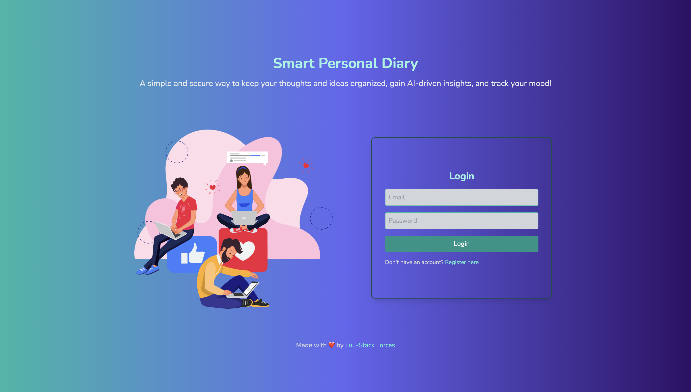
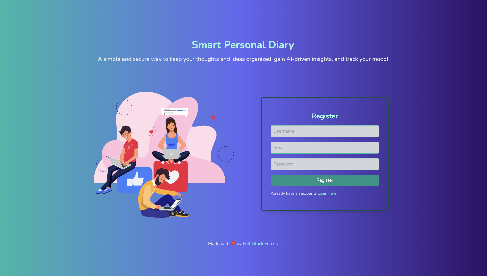
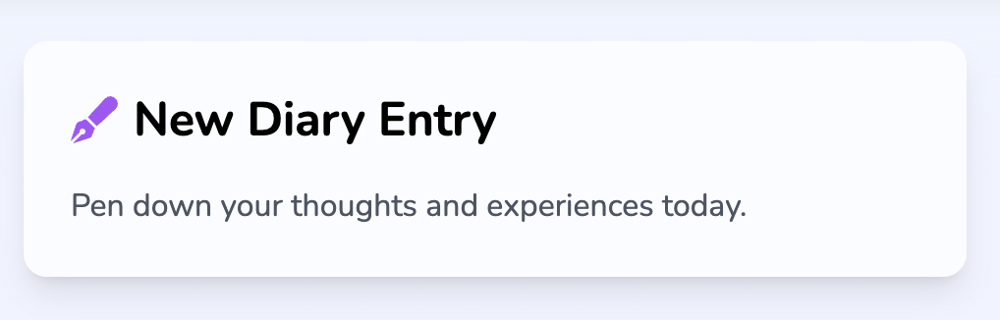
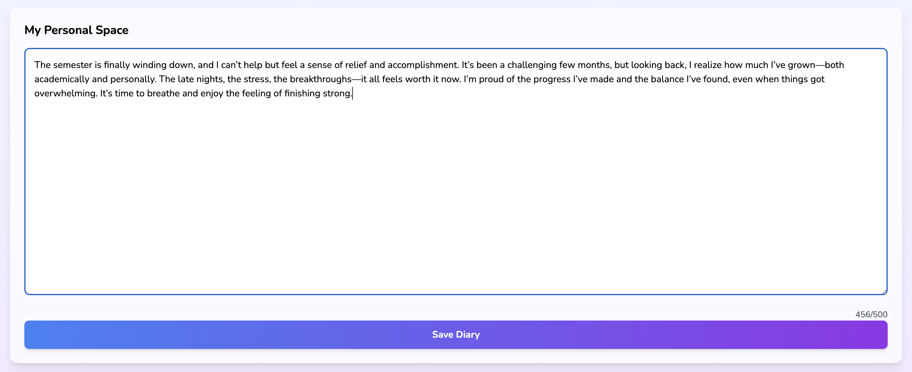
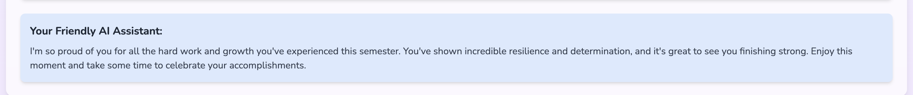
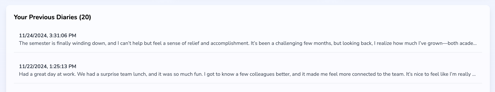
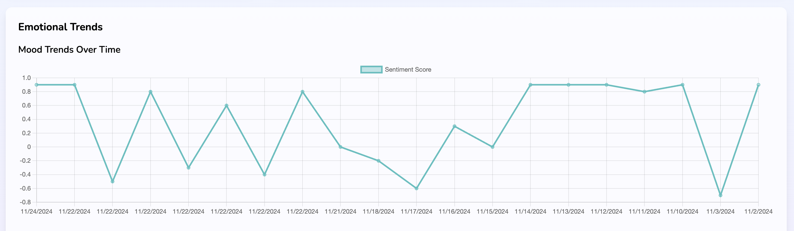
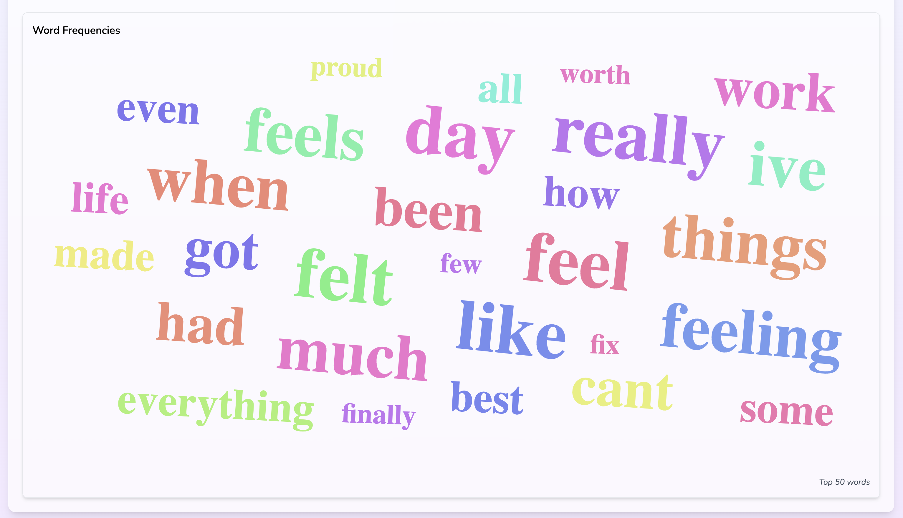

# My Smart Diary Frontend

My Smart Diary is a modern, user-friendly web application that allows users to write diary entries, analyze emotional trends, and visualize word clouds. This README is specific to the frontend of the application, which is built with React, Tailwind CSS, and integrated with the backend API.

---

## 📜 Project Overview

The frontend of **My Smart Diary** is a sleek, responsive React application designed to interact seamlessly with the backend API. Users can:

- Write new diary entries.
- View previous entries.
- Analyze emotional trends over time with interactive line charts.
- Explore frequent words in diary entries via a word cloud.

---

## 🚀 Features

1. **User Authentication**: Redirects to login if the token is missing.
2. **Diary Management**:
   - Create, edit, and delete entries.
   - Auto-response generated for entries.
3. **Emotional Trends Visualization**:
   - Line charts display mood trends over time.
   - Word clouds visualize frequent words.
4. **Responsive Design**: Optimized for all screen sizes using Tailwind CSS.
5. **Loading Animations**: Smooth UX during API interactions.

---

### 📦 Folder Descriptions

- **assets/**: Contains JSON files for animations used in the app.
- **components/**: Reusable React components. Includes:
  - `LineChart.js`: Renders mood trend charts using `react-chartjs-2`.
- **pages/**: Main page-level components for routing:
  - `DashboardPage.js`: Implements diary management and visualizations.
  - `HomePage.js`: The landing page with app introduction.
- **utils/**: Utility functions and API service.
  - `api.js`: Configures API calls with `axios`.
- **App.js**: Entry point for React component tree.
- **App.css**: Styles for the app.
- **index.js**: Bootstraps the React app.
- **tailwind.config.js**: Tailwind CSS configuration.

---

## 🔧 Installation and Setup

### Prerequisites

- [Node.js](https://nodejs.org/) (v16 or later)
- [npm](https://www.npmjs.com/)

## Steps to Install and Run

1. Clone the repository:

   ```bash
   git clone https://github.com/SahandNamvar/smart-diary-app-frontend.git
   cd smart-diary-app/frontend
   ```

2. Install dependencies:
   ```bash
    npm install
   ```
3. Set up the backend (optional - for full functionality):

   - Navigate to the `backend` repository and follow the instructions in the [smart-diary-app-backend](https://github.com/SahandNamvar/smart-diary-app-backend).

4. Start the development server:

   ```bash
    npm start
   ```

5. Open the app in your browser at `http://localhost:3000`.

---

## 🖥️ Usage

**Main Features Walkthrough**:

### 1. Home Page

- Landing page with app introduction.

| Login Page                                                        | Register Page                                                               |
| ----------------------------------------------------------------- | --------------------------------------------------------------------------- |
|  |  |

### 2. Dashboard

- Diary management

| Add New Diary                                                       | Add New Diary                                                                |
| ------------------------------------------------------------------- | ---------------------------------------------------------------------------- |
|  |  |

- GPT-3 auto-response generated for the submitted diary entry.

| Auto-Response                                                             |
| ------------------------------------------------------------------------- |
|  |

- View previous diary entries.

| View Previous Diaries                                                     | Previous Diaries                                                                       |
| ------------------------------------------------------------------------- | -------------------------------------------------------------------------------------- |
|  |  |

- View Specific Diary Entry (Modal)

| View Specific Diary Entry                                                     |
| ----------------------------------------------------------------------------- |
|  |

- Emotional Trends Visualization (Graphs)

| Line Chart (Mood Trends)                                              | Word Cloud (Frequent Words)                                           |
| --------------------------------------------------------------------- | --------------------------------------------------------------------- |
|  |  |
